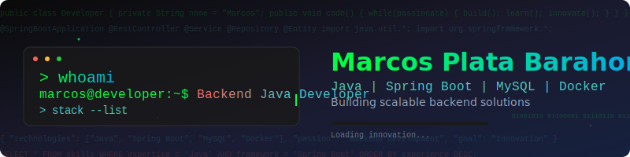

# 👋 ¡Hola, soy Marcos!

🎓 **Estudiante de Tecnología en Inteligencia Artificial**  
💻 **Desarrollador Backend especializado en Java y Spring Boot**  
🚀 **Construyendo soluciones tecnológicas innovadoras**

---

## 🚀 Stack Tecnológico

---

## 🛠 Proyectos Destacados

### 🎯 Sistema de Gestión de Tareas
- **Stack:** Spring Boot + MySQL + HTML/CSS/JS
- **Características:** CRUD completo, autenticación de usuarios, interfaz responsive
- **Estado:** En desarrollo activo

### 🎵 Automatización de Descargas
- **Stack:** Python + APIs de YouTube
- **Funcionalidad:** Descarga automatizada de música y videos con interfaz CLI
- **Estado:** Funcional y en mejoras

### 📊 Proyectos Universitarios
- **Enfoque:** Análisis de datos, UX/UI, Inteligencia Artificial
- **Tecnologías:** Python, bibliotecas de análisis de datos
- **Estado:** Múltiples proyectos en curso

---

## 🧠 Actualmente Aprendiendo

- 🏗️ **Arquitectura de Software:** Patrones de diseño, clean architecture
- 🔐 **Seguridad:** JWT, OAuth2, mejores prácticas de autenticación
- 📱 **Frontend Moderno:** Angular avanzado, componentes reutilizables
- ☁️ **Cloud Computing:** Preparándome para certificaciones AWS
- 🤖 **IA/ML:** Integración de modelos de machine learning en aplicaciones

---

## 📈 GitHub Analytics

---

## 🤝 Colaboración y Contacto

¿Tienes un proyecto interesante? ¿Te gustaría colaborar? ¡Hablemos!

---

## 💡 Filosofía de Desarrollo

> *"El código limpio no se escribe siguiendo un conjunto de reglas. No te conviertes en un artesano del software leyendo un libro. Se convierte uno al trabajar duro y practicar."*
> 
> **Robert C. Martin**

Creo firmemente en:
- 📝 **Código limpio y mantenible**
- 🧪 **Testing como práctica fundamental**
- 🔄 **Mejora continua y aprendizaje constante**
- 🤝 **Colaboración y comunicación efectiva**

---

**¡Gracias por visitar mi perfil! 🚀**

⭐ *Si te gusta alguno de mis proyectos, no dudes en darle una estrella*

